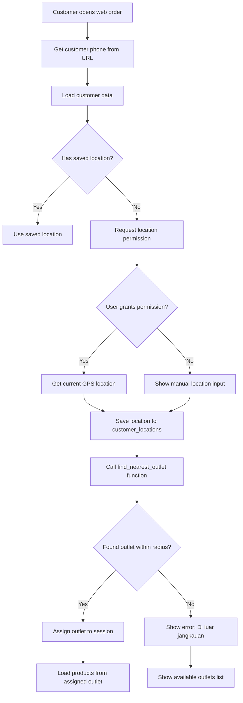
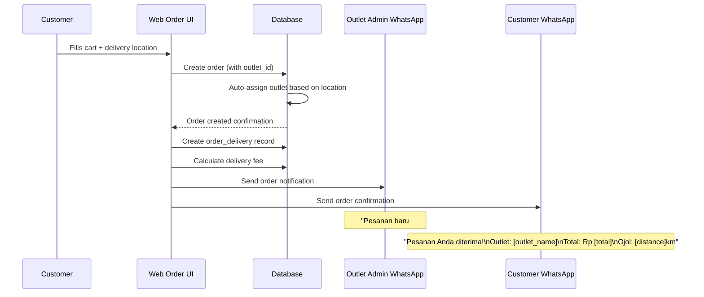

# Feisty Multi-Outlet Location-Based Ordering System
## Technical Specification

---

## 1. Executive Summary

This specification outlines the technical implementation for Feisty's multi-outlet location-based ordering system. The system will support multiple outlets within a 20KM radius each, automatically assign orders to the nearest outlet, and provide a mobile-first ordering experience.

**Key Requirements:**
- Multi-outlet support with 20KM delivery radius per outlet
- Customer location-based outlet assignment
- Web Order flow: Customer Info → Menu → Delivery Location
- Dual WhatsApp notifications (outlet admin + customer)
- Mobile-first UI design

---

## 2. Database Schema Changes

### 2.1 New Tables

```sql
-- ============================================================
-- TABLE: outlet_locations
-- Purpose: Store outlet coordinates for distance calculations
-- ============================================================
CREATE TABLE outlet_locations (
    id UUID PRIMARY KEY DEFAULT uuid_generate_v4(),
    outlet_id UUID REFERENCES outlets(id) ON DELETE CASCADE,
    latitude DECIMAL(10, 8) NOT NULL,
    longitude DECIMAL(11, 8) NOT NULL,
    radius_km DECIMAL(5, 2) DEFAULT 20.00,  -- 20KM default radius
    free_delivery_km DECIMAL(5, 2) DEFAULT 3.00,
    delivery_fee_per_km INTEGER DEFAULT 2000,  -- Rp 2000 per km beyond free radius
    created_at TIMESTAMP WITH TIME ZONE DEFAULT NOW()
);

-- ============================================================
-- TABLE: customer_locations
-- Purpose: Store customer location for outlet assignment
-- ============================================================
CREATE TABLE customer_locations (
    id UUID PRIMARY KEY DEFAULT uuid_generate_v4(),
    customer_id UUID UNIQUE REFERENCES customers(id) ON DELETE CASCADE,
    latitude DECIMAL(10, 8) NOT NULL,
    longitude DECIMAL(11, 8) NOT NULL,
    address TEXT,
    updated_at TIMESTAMP WITH TIME ZONE DEFAULT NOW()
);

-- ============================================================
-- TABLE: order_delivery
-- Purpose: Store delivery location for each order
-- ============================================================
CREATE TABLE order_delivery (
    id UUID PRIMARY KEY DEFAULT uuid_generate_v4(),
    order_id UUID UNIQUE REFERENCES orders(id) ON DELETE CASCADE,
    latitude DECIMAL(10, 8) NOT NULL,
    longitude DECIMAL(11, 8) NOT NULL,
    address TEXT NOT NULL,
    distance_km DECIMAL(5, 2),
    delivery_fee INTEGER DEFAULT 0,
    notes TEXT,
    created_at TIMESTAMP WITH TIME ZONE DEFAULT NOW()
);

-- ============================================================
-- TABLE: outlet_whatsapp
-- Purpose: Store WhatsApp numbers for each outlet admin
-- ============================================================
CREATE TABLE outlet_whatsapp (
    id UUID PRIMARY KEY DEFAULT uuid_generate_v4(),
    outlet_id UUID REFERENCES outlets(id) ON DELETE CASCADE,
    phone_number VARCHAR(50) NOT NULL,
    is_primary BOOLEAN DEFAULT true,
    created_at TIMESTAMP WITH TIME ZONE DEFAULT NOW()
);
```

### 2.2 Modified Tables

```sql
-- ============================================================
-- MODIFY: outlets table - Add location reference and active status
-- ============================================================
ALTER TABLE outlets 
ADD COLUMN IF NOT EXISTS location_id UUID REFERENCES outlet_locations(id),
ADD COLUMN IF NOT EXISTS whatsapp_number VARCHAR(50),
ADD COLUMN IF NOT EXISTS is_active BOOLEAN DEFAULT true;

-- ============================================================
-- MODIFY: customers table - Add customer photo
-- ============================================================
ALTER TABLE customers 
ADD COLUMN IF NOT EXISTS photo_url TEXT,
ADD COLUMN IF NOT EXISTS default_location_id UUID REFERENCES customer_locations(id);

-- ============================================================
-- MODIFY: delivery_zones table - Expand for multi-outlet
-- ============================================================
ALTER TABLE delivery_zones 
ADD COLUMN IF NOT EXISTS outlet_id UUID REFERENCES outlets(id) ON DELETE CASCADE;

-- Update existing delivery zone to reference Malili outlet
UPDATE delivery_zones 
SET outlet_id = '00000000-0000-0000-0000-000000000001' 
WHERE outlet_id IS NULL;
```

### 2.3 Database Functions

```sql
-- ============================================================
-- FUNCTION: find_nearest_outlet
-- Purpose: Find nearest outlet within radius for given coordinates
-- ============================================================
CREATE OR REPLACE FUNCTION find_nearest_outlet(
    customer_lat DECIMAL(10, 8),
    customer_lng DECIMAL(11, 8)
)
RETURNS TABLE(
    outlet_id UUID,
    outlet_name VARCHAR,
    distance_km DECIMAL(5, 2),
    radius_km DECIMAL(5, 2),
    can_deliver BOOLEAN,
    free_delivery_km DECIMAL(5, 2),
    delivery_fee_per_km INTEGER
) AS $$
BEGIN
    RETURN QUERY
    SELECT 
        o.id AS outlet_id,
        o.name AS outlet_name,
        (
            6371 * acos(
                cos(radians(customer_lat)) * cos(radians(ol.latitude)) * 
                cos(radians(ol.longitude) - radians(customer_lng)) + 
                sin(radians(customer_lat)) * sin(radians(ol.latitude))
            )
        )::DECIMAL(5,2) AS distance_km,
        ol.radius_km,
        (
            6371 * acos(
                cos(radians(customer_lat)) * cos(radians(ol.latitude)) * 
                cos(radians(ol.longitude) - radians(customer_lng)) + 
                sin(radians(customer_lat)) * sin(radians(ol.latitude))
            )
        ) <= ol.radius_km AS can_deliver,
        ol.free_delivery_km,
        ol.delivery_fee_per_km
    FROM outlets o
    JOIN outlet_locations ol ON o.id = ol.outlet_id
    WHERE o.active = true
    ORDER BY distance_km
    LIMIT 1;
END;
$$ LANGUAGE plpgsql SECURITY DEFINER;

-- ============================================================
-- FUNCTION: calculate_delivery_fee
-- Purpose: Calculate delivery fee based on distance
-- ============================================================
CREATE OR REPLACE FUNCTION calculate_delivery_fee(
    distance_km DECIMAL(5, 2),
    free_radius_km DECIMAL(5, 2),
    fee_per_km INTEGER
)
RETURNS INTEGER AS $$
DECLARE
    chargeable_distance DECIMAL(5, 2);
BEGIN
    IF distance_km <= free_radius_km THEN
        RETURN 0;
    END IF;
    
    chargeable_distance := distance_km - free_radius_km;
    RETURN (chargeable_distance * fee_per_km)::INTEGER;
END;
$$ LANGUAGE plpgsql IMMUTABLE;

-- ============================================================
-- FUNCTION: get_available_outlets
-- Purpose: Get all outlets that can deliver to given location
-- ============================================================
CREATE OR REPLACE FUNCTION get_available_outlets(
    customer_lat DECIMAL(10, 8),
    customer_lng DECIMAL(11, 8)
)
RETURNS TABLE(
    outlet_id UUID,
    outlet_name VARCHAR,
    outlet_address TEXT,
    distance_km DECIMAL(5, 2),
    can_deliver BOOLEAN
) AS $$
BEGIN
    RETURN QUERY
    SELECT 
        o.id AS outlet_id,
        o.name AS outlet_name,
        o.address AS outlet_address,
        (
            6371 * acos(
                cos(radians(customer_lat)) * cos(radians(ol.latitude)) * 
                cos(radians(ol.longitude) - radians(customer_lng)) + 
                sin(radians(customer_lat)) * sin(radians(ol.latitude))
            )
        )::DECIMAL(5,2) AS distance_km,
        (
            6371 * acos(
                cos(radians(customer_lat)) * cos(radians(ol.latitude)) * 
                cos(radians(ol.longitude) - radians(customer_lng)) + 
                sin(radians(customer_lat)) * sin(radians(ol.latitude))
            )
        ) <= ol.radius_km AS can_deliver
    FROM outlets o
    JOIN outlet_locations ol ON o.id = ol.outlet_id
    WHERE o.active = true
    ORDER BY distance_km;
END;
$$ LANGUAGE plpgsql SECURITY DEFINER;
```

### 2.4 Indexes for Performance

```sql
-- Indexes for location-based queries
CREATE INDEX idx_outlet_locations_coords ON outlet_locations(latitude, longitude);
CREATE INDEX idx_customer ON customer_locations(_locations_coordslatitude, longitude);
CREATE INDEX idx_order_delivery_order_id ON order_delivery(order_id);
CREATE INDEX idx_outlet_whatsapp_outlet ON outlet_whatsapp(outlet_id);
```

---

## 3. Web Order Flow

### 3.1 New User Flow (Revised)

```
┌─────────────────────────────────────────────────────────────┐
│  STEP 1: CUSTOMER INFO (with photo)                        │
├─────────────────────────────────────────────────────────────┤
│  • Customer phone/name from WhatsApp link                  │
│  • Display customer photo (if available)                   │
│  • Show saved addresses / location                         │
│  • "Lanjutkan" button to Step 2                            │
└─────────────────────────────────────────────────────────────┘
                            ▼
┌─────────────────────────────────────────────────────────────┐
│  STEP 2: MENU SELECTION                                     │
├─────────────────────────────────────────────────────────────┤
│  • Products from ASSIGNED OUTLET only                     │
│  • Cart functionality (add/remove items)                   │
│  • Running total display                                    │
│  • "Lanjut ke Pengiriman" button to Step 3               │
└─────────────────────────────────────────────────────────────┘
                            ▼
┌─────────────────────────────────────────────────────────────┐
│  STEP 3: DELIVERY LOCATION                                 │
├─────────────────────────────────────────────────────────────┤
│  • Map picker for delivery location                        │
│  • Manual address input                                    │
│  • Show:                                                    │
│    - Assigned outlet info                                  │
│    - Distance from outlet                                  │
│    - Delivery fee (if any)                                 │
│    - Estimated delivery time                              │
│  • Order notes field                                       │
│  • "Pesan Sekarang" button                                 │
└─────────────────────────────────────────────────────────────┘
```

### 3.2 URL Parameters for Web Order

```
https://feisty.my.id/weborder?phone=0812xxxx&name=John&ref=XXXXX
```

### 3.3 Key UI Components

| Component | Description |
|-----------|-------------|
| Location Picker | Map-based location selection with current location detection |
| Outlet Badge | Shows assigned outlet with distance |
| Delivery Fee Calculator | Real-time calculation based on distance |
| Order Summary | Sticky footer showing cart total + delivery |

---

## 4. Order Routing Logic

### 4.1 Outlet Assignment Algorithm



### 4.2 Order Creation Flow



### 4.3 Delivery Fee Calculation

```
IF distance_km <= free_delivery_km:
    delivery_fee = 0
ELSE:
    chargeable_km = distance_km - free_delivery_km
    delivery_fee = chargeable_km * delivery_fee_per_km
```

Example:
- Outlet: Malili (free delivery 3km, Rp 2000/km)
- Customer: 8km away
- Delivery fee: (8 - 3) × 2000 = Rp 10,000

---

## 5. WhatsApp Integration

### 5.1 Outlet Admin Notification

```typescript
// Order notification to outlet admin
const outletAdminMessage = `
🍔 *PESANAN BARU - Feisty*

📋 *Order ID:* #${orderId.slice(0, 8)}
👤 *Pelanggan:* ${customerName}
📱 *Telepon:* ${customerPhone}
📍 *Alamat:* ${deliveryAddress}
📏 *Jarak:* ${distance}km
💰 *Ojol:* Rp ${deliveryFee.toLocaleString('id-ID')}

🛒 *Pesanan:*
${orderItems.map(item => `• ${item.quantity}x ${item.product_name} - Rp ${item.subtotal.toLocaleString('id-ID')}`).join('\n')}

💵 *Total:* Rp ${total.toLocaleString('id-ID')}

⏰ *Waktu:* ${new Date().toLocaleString('id-ID')}
`;

await sendWhatsAppMessage(outletWhatsAppNumber, outletAdminMessage);
```

### 5.2 Customer Confirmation

```typescript
// Order confirmation to customer
const customerMessage = `
✅ *Pesanan Diterima!*

👋 Halo ${customerName}!

📋 *Order ID:* #${orderId.slice(0, 8)}
🏪 *Outlet:* ${outletName}
📍 *Alamat:* ${deliveryAddress}
📏 *Jarak:* ${distance}km
🚴 *Ojol:* ${deliveryFee > 0 ? `Rp ${deliveryFee.toLocaleString('id-ID')}` : 'Gratis'}

🛒 *Pesanan:*
${orderItems.map(item => `• ${item.quantity}x ${item.product_name}`).join('\n')}

💵 *Total:* Rp ${total.toLocaleString('id-ID')}

⏰ Pesanan akan diproses oleh ${outletName}
📞 Hubungi kami jika ada pertanyaan!

Terima kasih sudah memesan di Feisty! 🙏
`;

await sendWhatsAppMessage(customerPhone, customerMessage);
```

---

## 6. UI/UX Design

### 6.1 Design Principles

1. **Mobile-First**: All designs start from mobile viewport
2. **Minimal Steps**: Maximum 3 steps to complete order
3. **Clear Feedback**: Loading states, success messages, error handling
4. **Location-Centric**: Location is the first consideration after customer info

### 6.2 Color Scheme (Existing)

| Color | Hex | Usage |
|-------|-----|-------|
| Primary | #FF6B35 | CTAs, highlights |
| Primary Dark | #E85A24 | Hover states |
| Secondary | #1A1A2E | Text, headers |
| Accent | #F7C94B | Badges, rewards |
| Light | #FFF8F0 | Background |
| Success | #25D366 | Confirmations |
| Danger | #FF4757 | Errors |

### 6.3 Key Screens

#### Step 1: Customer Info
- Customer photo (circular, 80px)
- Name display
- Phone number
- Saved addresses list
- "Gunakan lokasi saat ini" button

#### Step 2: Menu
- Outlet name badge at top: "Feisty Malili - 3km"
- Category tabs
- Product grid (2 columns)
- Cart FAB (floating action button)
- Sticky footer with total

#### Step 3: Delivery Location
- Map with marker
- Address input field
- Distance & delivery fee display
- Notes textarea
- "Pesan Sekarang" button with full total

### 6.4 Responsive Breakpoints

| Breakpoint | Width | Adjustments |
|------------|-------|-------------|
| Mobile | < 640px | Single column, full width |
| Tablet | 640-1024px | 2-column products |
| Desktop | > 1024px | Max-width container, centered |

---

## 7. Implementation Priorities

### Phase 1: Core Infrastructure
1. [ ] Add outlet_locations table with coordinates
2. [ ] Add customer_locations table
3. [ ] Add order_delivery table
4. [ ] Implement find_nearest_outlet function
5. [ ] Implement calculate_delivery_fee function

### Phase 2: Web Order UI
1. [ ] Restructure weborder/index.html to 3-step flow
2. [ ] Add location picker component
3. [ ] Add customer photo support
4. [ ] Add delivery fee display
5. [ ] Update product loading to use outlet_id

### Phase 3: Order Processing
1. [ ] Update order creation to include outlet_id auto-assignment
2. [ ] Create order_delivery record on checkout
3. [ ] Implement WhatsApp notifications to outlet admin
4. [ ] Implement WhatsApp notifications to customer

### Phase 4: Admin Dashboard
1. [ ] Add outlet location management in admin
2. [ ] Add delivery zone configuration
3. [ ] Add outlet WhatsApp number management

---

## 8. API Endpoints

### New Endpoints

| Method | Endpoint | Description |
|--------|----------|-------------|
| GET | /rest/v1/outlet_locations | Get all outlet locations |
| POST | /rest/v1/outlet_locations | Create outlet location |
| GET | /rest/v1/rpc/find_nearest_outlet | Find nearest outlet |
| GET | /rest/v1/rpc/get_available_outlets | Get deliverable outlets |
| GET | /rest/v1/rpc/calculate_delivery_fee | Calculate delivery fee |
| GET | /rest/v1/customer_locations | Get customer locations |
| POST | /rest/v1/customer_locations | Save customer location |
| GET | /rest/v1/order_delivery | Get order delivery details |
| POST | /rest/v1/order_delivery | Create delivery record |

### Modified Endpoints

| Method | Endpoint | Change |
|--------|----------|--------|
| GET | /rest/v1/products | Filter by outlet_id |
| POST | /rest/v1/orders | Auto-assign outlet_id |
| POST | /weborder/index.html | 3-step flow |

---

## 9. Configuration

### Environment Variables

```env
# Supabase
SUPABASE_URL=https://ztefkcbgkdqgvcfphvys.supabase.co
SUPABASE_ANON_KEY=...

# WhatsApp (Whacenter)
WHATSAPP_DEVICE_ID=92b2af76-130d-46f0-b811-0874e3407988

# Web Order
WEB_ORDER_URL=https://feisty.my.id/weborder

# Maps (Google Maps API or OpenStreetMap)
MAPS_API_KEY=...
```

### Default Values

- Delivery radius: 20KM
- Free delivery radius: 3KM
- Delivery fee per km: Rp 2,000

---

## 10. Security Considerations

1. **Location Data**: Customer locations are sensitive - implement RLS policies
2. **Order Access**: Only relevant outlet admins can see their orders
3. **WhatsApp**: Validate webhook requests with secret key
4. **Customer Data**: Phone numbers should be masked in admin dashboard

---

## 11. Migration Strategy

```sql
-- Run in sequence:

-- 1. Create new tables
-- 2. Add columns to existing tables
-- 3. Insert outlet location for Malili
-- 4. Create indexes
-- 5. Add RLS policies
-- 6. Create database functions
```

---

*Document Version: 1.0*
*Last Updated: 2026-02-25*
